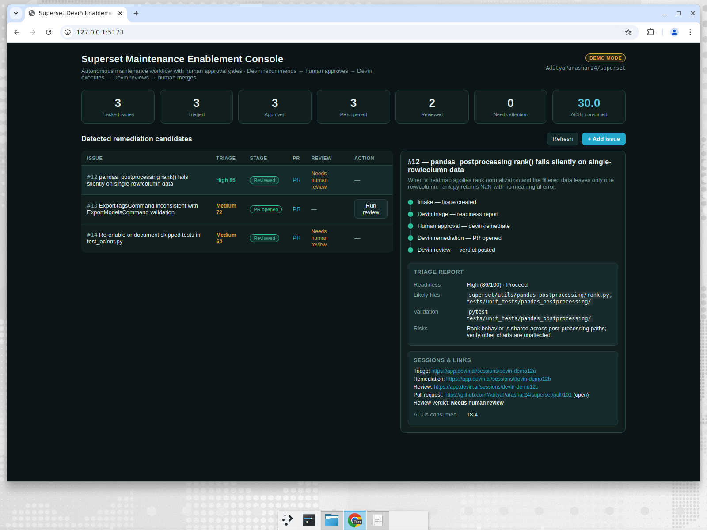

# Devin Orchestrator

A human-in-the-loop control plane that turns bounded **Apache Superset** maintenance
issues into reviewable pull requests using **Devin** — with a human approval gate at
every risky step.

> **Operating principle:** Devin *recommends*, a human *approves*, Devin *executes*,
> Devin *self-reviews*, a human *merges*. No code is changed without explicit human
> approval.



---

## What it does

For each GitHub issue, the console runs a three-stage pipeline backed by **separate
Devin sessions**, each with a role-specific prompt and ACU budget:

| Stage | Devin session | Allowed to | Output |
|-------|---------------|-----------|--------|
| **Triage** | read-only | analyze only — no edits, no PR | strict JSON readiness report |
| **Remediation** | code-changing | edit code, run tests, open a PR | a pull request |
| **Review** | comment-only (auto-started) | review the PR — no merge, no push | a verdict |

Between **Triage** and **Remediation** there is a **human approval gate**: a maintainer
clicks *Approve* in the dashboard, or adds the `devin-remediate` label on GitHub.
**Review** auto-starts when the PR is opened — no human gate needed.

### Two trigger paths

| Path | How it starts | What happens |
|------|---------------|--------------|
| **Label (event-driven)** | Human adds `devin-triage` or `devin-remediate` label on GitHub | GitHub Action fires → calls Devin API with full prompt + schema + ACU limits → comments session link on issue → backend discovers session by tag |
| **Dashboard (manual)** | Human enters issue # and clicks "Run triage" or "Approve" | Backend calls Devin API directly |

Both paths converge at the same state machine. The dashboard shows the same data
regardless of how the session was triggered.

### Why this design

- **Structured output, not prose parsing.** Triage and review sessions are forced to
  return JSON matching a JSON Schema via Devin's `structured_output_schema`, so the
  orchestrator gets deterministic fields instead of scraping free text.
- **The PR comes from the session, not GitHub scraping.** The remediation session object
  exposes `pull_requests[]`, so the orchestrator reads the PR URL/state directly.
- **Bounded autonomy.** Each role has a `max_acu_limit` so a runaway session can't burn
  budget.
- **Human clarification loop.** When triage surfaces questions, the human answers via a
  GitHub comment.
- **Single session creation path.** Both the dashboard and direct label application on
  GitHub converge on the same GitHub Action to create Devin sessions. The backend only
  adds labels — it never calls the Devin API to create sessions directly (except for
  the auto-review stage). This eliminates duplicate sessions.

---

## Architecture

```
┌──────────────────────────┐          ┌──────────────────────────┐
│  GitHub Issue             │          │  React + Vite Dashboard  │
│                          │          │  localhost:5173           │
│  Human adds label:       │          │                          │
│  devin-triage or         │          │  "Run triage" / "Approve"│
│  devin-remediate         │          │    buttons                 │
└──────────┬───────────────┘          └──────────┬───────────────┘
           │                                     │
           ▼                                     │
┌──────────────────────────┐   polls /api/issues │
│  GitHub Action            │   POST /api/triage  │
│  (in Superset fork)       │   POST /api/remediate
│                          │                     │
│  Calls Devin API directly│                     │
│  Tags: devin-orchestrator│                     │
│  + role + issue-N        │                     │
└──────────┬───────────────┘                     │
           │                                     │
           │  (backend discovers                 │
           │   via tag polling)                  │
           ▼                                     ▼
┌──────────────────────────────────────────────────────────────┐
│                    FastAPI Backend (port 8080)                │
│                                                              │
│  orchestrator.py  — state machine, discover_sessions(),      │
│                     review schema, stage handlers             │
│  devin_client.py  — create/get/list/stop session             │
│  github_client.py — get_issue, add_label, comment            │
│  store.py         — SQLite persistence                       │
│  prompts/         — triage.md, remediation.md, review.md     │
└──────────┬──────────────────────────────────┬────────────────┘
           │                                  │
           ▼                                  ▼
┌──────────────────────┐        ┌──────────────────────────┐
│   Devin REST API     │        │     GitHub REST API      │
│   api.devin.ai       │        │     api.github.com       │
└──────────────────────┘        └──────────────────────────┘
```

### Session discovery

Every Devin session is tagged `["devin-orchestrator", "{role}", "issue-{N}"]`.

On every poll cycle (~20s), the backend calls `list_sessions()`, filters by the
`devin-orchestrator` tag, and matches sessions to issues via `issue-N` tags. Sessions
started by the GitHub Action are adopted into the state machine. The dashboard triggers
sessions indirectly by adding labels, which fire the same GitHub Action.

### Pipeline states

```
new → triaging → triaged → remediating → pr_open → reviewing → reviewed
                    │
                    ▼
                [human approval]

Any state → needs_attention (on error / no PR / invalid output)
```

### Labels (audit trail on GitHub issue)

| When | Label added |
|------|-------------|
| Triage starts | `devin-triage` |
| Triage completes | `devin-triaged` |
| Remediation approved | `devin-remediate` |
| PR opened | `devin-pr-open` |
| Review completes | `devin-reviewed` |

### Comments (audit trail on GitHub issue)

| When | Comment posted |
|------|----------------|
| Triage session starts | "Devin triage session started: {url}" |
| Triage completes | Triage report (readiness, risks, clarification, likely files) |
| Remediation session starts | "Devin remediation session started: {url}" |
| Review completes | Review verdict + concerns + follow-ups |

---

## Quick start (Docker)

### 1. Configure
```bash
cp .env.example .env
# edit .env with your Devin + GitHub credentials
```

### 2. Run
```bash
docker compose up --build
```

Open http://localhost:3000.

- Frontend (nginx): port 3000
- Backend (FastAPI): port 8080

---

## Quick start (without Docker)

### 0. Prerequisites
- Python 3.11+
- Node 18+

### 1. Configure
```bash
cp .env.example .env
# edit .env with your Devin + GitHub credentials
```

### 2. Backend
```bash
cd backend
python -m venv .venv && source .venv/bin/activate
pip install -r requirements.txt
uvicorn main:app --reload --port 8080
```

### 3. Frontend
```bash
cd frontend
npm install
npm run dev           # http://localhost:5173 (proxies /api to :8080)
```

Open http://localhost:5173.

### 4. (Optional) Event-driven label trigger

To enable the label path, add the GitHub Action to your **Superset fork**
(not this repo):

1. Copy `devin-on-label.yml` to `<superset-fork>/.github/workflows/`
2. Add repo secrets: `DEVIN_API_KEY`, `DEVIN_ORG_ID`
3. Create labels on the fork: `devin-triage`, `devin-remediate`

Now applying `devin-triage` to an issue fires a triage session automatically.

---

## Required credentials

All four must be set in `.env` for the orchestrator to function:

- `DEVIN_API_KEY` — a Devin service-user token (`app.devin.ai` → Settings → Service Users)
- `DEVIN_ORG_ID` — your org id (`org-…`)
- `GITHUB_TOKEN` — PAT with `issues:write` + `pull_requests:read`
- `GITHUB_REPO` — e.g. `AdityaParashar24/superset`

---

## API reference

| Method | Path | Purpose |
|--------|------|---------|
| GET  | `/api/health` | mode + config status |
| GET  | `/api/issues` | all tracked issues |
| GET  | `/api/issues/{n}` | one issue |
| GET  | `/api/summary` | KPI counts |
| POST | `/api/issues` | track a new issue |
| POST | `/api/triage/{n}` | start (or re-run) a triage session |
| POST | `/api/remediate/{n}` | approve → start remediation (the human gate) |
| POST | `/api/review/{n}` | start a review session (normally auto-started) |
| POST | `/api/poll` | force a poll tick |

---

## Candidate issues (Superset)

Real, bounded issues in the fork that this console was designed around:

1. **`pandas_postprocessing` rank edge case** — `superset/utils/pandas_postprocessing/rank.py`
2. **`ExportTagsCommand` validation consistency** — `superset/commands/tag/export.py`
3. **Re-enable skipped tests** — `tests/unit_tests/db_engine_specs/test_ocient.py`

---

## Project layout

```
superset-devin-orchestrator/
├── .env.example
├── backend/
│   ├── main.py            # FastAPI app + routes + poll loop
│   ├── orchestrator.py    # state machine, discover_sessions(), triage/review schemas
│   ├── devin_client.py    # Devin REST wrapper (v3)
│   ├── github_client.py   # issue/label/comment
│   ├── store.py           # SQLite CRUD
│   ├── models.py          # Pydantic models + enums
│   ├── config.py          # .env loader
│   └── prompts/
│       ├── triage.md      # read-only analysis prompt
│       ├── remediation.md # fix + open PR prompt
│       └── review.md      # PR review prompt
└── frontend/              # React + Vite dashboard
```
